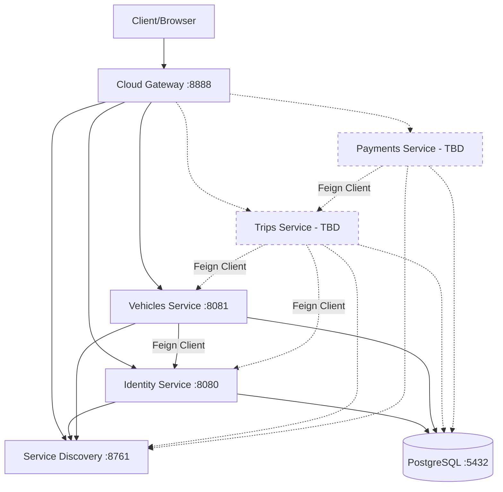

# 📊 IPCB Car Pooling - Comprehensive Project Analysis

## 🎯 Executive Summary

This is a **microservices-based car pooling platform** developed for IPCB (Instituto Politécnico de Castelo Branco) as an academic project. The system enables users to share rides, reducing costs and promoting sustainable mobility through a distributed architecture using Spring Boot and Docker.

---

## 🏗️ Architecture Overview

### Architecture Type
**Microservices Architecture** with:
- Service Discovery (Netflix Eureka)
- API Gateway (Spring Cloud Gateway)
- Independent, containerized services
- Docker Swarm orchestration support
- Shared PostgreSQL database (multi-schema approach)

### Technology Stack

| Component | Technology | Version |
|-----------|-----------|---------|
| **Language** | Java | 21 |
| **Framework** | Spring Boot | 3.4.1 |
| **Cloud** | Spring Cloud | 2024.0.0 |
| **Database** | PostgreSQL | 16 |
| **Containerization** | Docker & Docker Compose | Latest |
| **Service Discovery** | Netflix Eureka | 2024.0.0 |
| **API Gateway** | Spring Cloud Gateway | 2024.0.0 |
| **Inter-service Communication** | OpenFeign | 2024.0.0 |
| **Security** | Spring Security + JWT | Latest |
| **API Documentation** | SpringDoc OpenAPI | 2.8.14 |
| **Build Tool** | Maven | Latest |
| **Utilities** | Lombok | 1.18.36 |

---

## 🔧 Microservices Breakdown

### 1. **Service Discovery** (Eureka Server)
- **Port**: `8761`
- **Purpose**: Service registry and discovery
- **Technology**: Netflix Eureka
- **Replicas**: 1 (stateful)
- **Key Features**:
  - Central service registry
  - Health monitoring
  - Load balancing support
  - Dashboard UI at http://localhost:8761

### 2. **Cloud Gateway Service**
- **Port**: `8888`
- **Purpose**: Single entry point for all API requests
- **Technology**: Spring Cloud Gateway
- **Replicas**: 2 (stateless)
- **Key Features**:
  - Request routing
  - Load balancing
  - Cross-cutting concerns (logging, security)
  - Routes:
    - `/identity/**` → Identity Service
    - `/vehicles/**` → Vehicles Service

### 3. **Identity Service**
- **Port**: `8080`
- **Database**: `identity_db`
- **Replicas**: 3 (stateless)
- **Purpose**: User management and authentication
- **Key Features**:
  - User registration and login
  - JWT-based authentication
  - Role management (ADMIN, DRIVER, PASSENGER)
  - Profile management
  - User ratings system

#### Domain Model (Identity Service)
```
📦 Entities:
├── UserEntity (Users table)
│   ├── User credentials
│   ├── Personal information
│   └── Role assignments
├── ProfileEntity (Profiles table)
│   ├── User profile details
│   └── Preferences
└── RatingEntity (Ratings table)
    ├── User ratings
    └── Reviews
```

**Dependencies**:
- Spring Web
- Spring Data JPA
- Spring Security
- PostgreSQL Driver
- JWT (Auth0)
- Eureka Client
- SpringDoc OpenAPI
- Lombok

### 4. **Vehicles Service**
- **Port**: `8081`
- **Database**: `vehicles_db`
- **Replicas**: 3 (stateless)
- **Purpose**: Vehicle and brand management
- **Key Features**:
  - Vehicle registration
  - Brand and model management
  - Vehicle-user association
  - Integration with Identity Service (via Feign)

#### Domain Model (Vehicles Service)
```
📦 Entities:
├── VehicleEntity (Vehicles table)
│   ├── Vehicle details
│   ├── Owner reference
│   └── Model reference
├── ModelEntity (Models table)
│   ├── Model information
│   └── Brand reference
└── BrandEntity (Brands table)
    └── Brand information
```

**Dependencies**:
- Spring Web
- Spring Data JPA
- Spring Security
- PostgreSQL Driver
- JWT (Auth0)
- Eureka Client
- **OpenFeign** (for inter-service communication)
- SpringDoc OpenAPI
- Lombok

### 5. **Trips Service** (trips)
- **Port**: Not yet configured in docker-stack.yml
- **Database**: TBD
- **Purpose**: Trip and booking management
- **Status**: ⚠️ **Partially Implemented**

#### Domain Model (Trips Service)
```
📦 Entities:
├── TripEntity
│   ├── Origin, destination
│   ├── Date/time
│   ├── Available seats
│   └── Driver reference
├── BookingEntity
│   ├── Trip reference
│   ├── Passenger reference
│   └── Status reference
├── BookingStatusEntity
│   └── Status definitions
├── TripStatusEntity
│   └── Trip status definitions
└── ExpenseEntity
    └── Trip-related expenses
```

**Key Features** (Planned):
- Create trips (drivers)
- Search trips (passengers)
- Book rides
- Manage trip status
- Track expenses

### 6. **Payments Service** (payments)
- **Port**: Not yet configured in docker-stack.yml
- **Database**: TBD
- **Purpose**: Cost calculation and payment tracking
- **Status**: ⚠️ **Partially Implemented**

#### Domain Model (Payments Service)
```
📦 Entities:
└── PaymentEntity
    ├── Payment details
    ├── Amount
    └── Trip reference
```

**Key Features** (Planned):
- Calculate total trip cost
- Split costs among passengers
- Payment history
- Transaction records

---

## 🗄️ Database Architecture

### Database Strategy
**Shared Database with Multiple Schemas**

```
PostgreSQL Server (db_server:5432)
├── identity_db (Identity Service)
├── vehicles_db (Vehicles Service)
├── trips_db (Trips Service) - TBD
└── payments_db (Payments Service) - TBD
```

**Credentials**:
- User: `admin`
- Password: `learnJava!2025`

---

## 🐳 Docker & Deployment

### Docker Compose Architecture

The project uses **two deployment strategies**:

#### 1. **Standard Docker Compose** (`start_all.sh`)
- Sequential service startup
- Development-friendly
- Easier debugging
- Services:
  1. Database (PostgreSQL)
  2. Service Discovery (Eureka)
  3. Identity Service
  4. Vehicles Service
  5. Cloud Gateway

#### 2. **Docker Swarm** (`deploy_swarm.sh`)
- Production-ready orchestration
- Service replication
- Load balancing
- Includes Portainer for visual management
- Overlay networking

### Network Configuration
- **Network Name**: `carpooling_network` (Compose) / `carpooling_overlay_network` (Swarm)
- **Driver**: Bridge (Compose) / Overlay (Swarm)

### Service Replicas (Swarm Mode)

| Service | Replicas | Type |
|---------|----------|------|
| Database | 1 | Stateful |
| Service Discovery | 1 | Stateful |
| Identity Service | 3 | Stateless |
| Vehicles Service | 3 | Stateless |
| Cloud Gateway | 2 | Stateless |
| Portainer | 1 | Management |

### Volumes
- `pg_data`: PostgreSQL data persistence
- `portainer_data`: Portainer configuration

---

## 📋 Use Cases (From OVERVIEW.MD)

### UC1 – Create Trip
**Actor**: Driver  
**Flow**: Driver creates trip with origin, destination, date/time, available seats

### UC2 – Search Trips
**Actor**: Passenger  
**Flow**: Passenger searches by origin, destination, date

### UC3 – Book Ride
**Actor**: Passenger  
**Flow**: 
1. Passenger sends booking request
2. Driver confirms

### UC4 – Calculate Costs
**Actor**: System  
**Flow**: System divides total cost among passengers

### UC5 – History
**Actor**: User  
**Flow**: User views completed trips and payments

---

## 🔐 Security Architecture

### Authentication & Authorization
- **JWT-based authentication**
- **Roles**:
  - `ADMIN`: System administration
  - `DRIVER`: Can create trips
  - `PASSENGER`: Can book rides
  - Users can have multiple roles

### Security Components
- Spring Security
- JWT token generation and validation (Auth0 library)
- Role-based access control (RBAC)
- Secured endpoints

---

## 🔄 Inter-Service Communication

### Communication Pattern
**REST-based synchronous communication** using OpenFeign

### Example: Vehicles → Identity
The Vehicles Service uses Feign Client to communicate with Identity Service to:
- Validate user ownership
- Retrieve user information
- Verify user roles

---

## 📁 Project Structure

```
TrabalhoPratico/
├── carpooling_docker_compose_db/     # Database Docker config
├── service-discovery/                # Eureka Server
├── cloud-gateway-service/            # API Gateway
├── identity/                         # Identity microservice
│   ├── src/main/java/pt/ipcb/car/pooling/identity/
│   │   ├── config/                   # Configuration
│   │   ├── exceptions/               # Exception handling
│   │   ├── modules/                  # Business modules
│   │   │   ├── user/
│   │   │   ├── profile/
│   │   │   └── rating/
│   │   ├── security/                 # Security config
│   │   └── utils/                    # Utilities
│   ├── pom.xml
│   └── Dockerfile
├── vehicles/                         # Vehicles microservice
│   ├── src/main/java/pt/ipcb/car/pooling/vehicles/
│   │   ├── config/
│   │   ├── exceptions/
│   │   ├── modules/
│   │   │   ├── vehicles/
│   │   │   ├── models/
│   │   │   └── brands/
│   │   ├── security/
│   │   └── utils/
│   ├── pom.xml
│   └── Dockerfile
├── trips/                         # Trips microservice (WIP)
│   └── src/main/java/pt/ipcb/car/pooling/trips/
├── payments/                      # Payments microservice (WIP)
│   └── src/main/java/pt/ipcb/car/pooling/payments/
├── docker-stack.yml                  # Swarm deployment config
├── start_all.sh                      # Compose startup script
├── deploy_swarm.sh                   # Swarm deployment script
├── remove_stack.sh                   # Swarm cleanup script
├── OVERVIEW.MD                       # Project overview
└── README.md                         # Setup instructions
```

---

## 🚀 How to Run

### Prerequisites
- Docker & Docker Compose
- Java 21 (for local development)
- Maven (for building)

### Option 1: Quick Start (Recommended)
```bash
chmod +x start_all.sh
./start_all.sh
```

### Option 2: Docker Swarm with Portainer
```bash
chmod +x deploy_swarm.sh
./deploy_swarm.sh
```
Access Portainer at: http://localhost:9000

### Option 3: Manual Startup
```bash
# 1. Create network
docker network create carpooling_network

# 2. Start database
docker compose -f carpooling_docker_compose_db/docker-compose.yml up -d --build

# 3. Start Eureka
docker compose -f service-discovery/docker-compose.yml up -d --build

# 4. Start microservices
docker compose -f identity/docker-compose.yml up -d --build
docker compose -f vehicles/docker-compose.yml up -d --build
docker compose -f cloud-gateway-service/docker-compose.yml up -d --build
```

### Verify Deployment
- **Eureka Dashboard**: http://localhost:8761
- **API Gateway**: http://localhost:8888
- **Identity API**: http://localhost:8080
- **Vehicles API**: http://localhost:8081
- **Portainer** (Swarm only): http://localhost:9000

---

## ⚠️ Current Status & Gaps

### ✅ Completed
1. **Infrastructure**:
   - ✅ Service Discovery (Eureka)
   - ✅ API Gateway
   - ✅ Docker containerization
   - ✅ Docker Swarm configuration
   - ✅ Database setup

2. **Identity Service**:
   - ✅ User management
   - ✅ Authentication (JWT)
   - ✅ Profile management
   - ✅ Rating system
   - ✅ Eureka integration

3. **Vehicles Service**:
   - ✅ Vehicle CRUD
   - ✅ Brand/Model management
   - ✅ Feign client integration
   - ✅ Eureka integration

### 🚧 In Progress / Missing

1. **Trips Service**:
   - ⚠️ Entities defined but not fully implemented
   - ❌ Not integrated into docker-stack.yml
   - ❌ No REST controllers visible
   - ❌ No service layer implementation
   - ❌ Missing Eureka registration

2. **Payments Service**:
   - ⚠️ Basic entity structure
   - ❌ Not integrated into docker-stack.yml
   - ❌ Cost calculation logic missing
   - ❌ No integration with Trips service
   - ❌ Missing Eureka registration

3. **Missing Features**:
   - ❌ GPS/Location service (mentioned in OVERVIEW.MD)
   - ❌ Notifications service (optional)
   - ❌ Admin service (mentioned in OVERVIEW.MD)
   - ❌ Front-end application
   - ❌ Integration tests
   - ❌ API documentation (Swagger UI endpoints)

4. **Documentation**:
   - ❌ API documentation
   - ❌ Postman collection
   - ❌ Architecture diagrams
   - ❌ Database schema diagrams

---

## 🎯 Recommended Next Steps

### Priority 1: Complete Core Services
1. **Trips Service**:
   - Implement REST controllers
   - Add service layer with business logic
   - Create repositories
   - Configure application.yml
   - Add to docker-stack.yml
   - Register with Eureka
   - Implement Feign clients for Identity/Vehicles

2. **Payments Service**:
   - Implement cost calculation logic
   - Create REST endpoints
   - Integrate with Trips service
   - Add to docker-stack.yml
   - Register with Eureka

### Priority 2: Integration & Testing
1. Add integration between services
2. Implement end-to-end workflows
3. Add unit tests
4. Add integration tests
5. Test Docker deployment

### Priority 3: Documentation & UI
1. Generate Swagger documentation
2. Create Postman collection
3. Build front-end (Thymeleaf or React/Vue)
4. Add architecture diagrams

### Priority 4: Advanced Features
1. GPS/Location service (simulated)
2. Notifications service
3. Admin dashboard
4. Circuit breakers (Resilience4j)
5. Distributed tracing
6. Centralized logging

---

## 📊 Service Dependency Graph



**Legend**:
- Solid lines: Implemented
- Dashed lines: Planned/Incomplete

---

## 🔍 Code Quality Observations

### Strengths
1. ✅ Clean package structure
2. ✅ Consistent naming conventions
3. ✅ Use of Lombok for boilerplate reduction
4. ✅ Proper separation of concerns (entities, repositories, services, controllers)
5. ✅ Docker-first approach
6. ✅ Modern Spring Boot 3.x and Java 21

### Areas for Improvement
1. ⚠️ Missing comprehensive error handling
2. ⚠️ No validation annotations visible
3. ⚠️ Missing API versioning strategy
4. ⚠️ No centralized configuration (Spring Cloud Config)
5. ⚠️ Missing distributed tracing
6. ⚠️ No circuit breakers implemented
7. ⚠️ Limited logging configuration

---

## 📚 Learning Objectives (Academic Context)

This project demonstrates understanding of:

1. **Microservices Architecture**
   - Service decomposition
   - Independent deployment
   - Distributed systems

2. **Spring Cloud Ecosystem**
   - Service discovery (Eureka)
   - API Gateway
   - Inter-service communication (Feign)

3. **Containerization**
   - Docker
   - Docker Compose
   - Docker Swarm

4. **Security**
   - JWT authentication
   - Role-based access control

5. **Database Management**
   - JPA/Hibernate
   - Multi-schema approach

6. **DevOps Practices**
   - Infrastructure as Code
   - Automated deployment scripts
   - Container orchestration

---

## 📞 Support & Resources

### Key Files to Reference
- **Project Overview**: [OVERVIEW.MD](file:///Users/derciosinione/Developer/IPCB/AD/TrabalhoPratico/OVERVIEW.MD)
- **Setup Guide**: [README.md](file:///Users/derciosinione/Developer/IPCB/AD/TrabalhoPratico/README.md)
- **Swarm Config**: [docker-stack.yml](file:///Users/derciosinione/Developer/IPCB/AD/TrabalhoPratico/docker-stack.yml)

### Useful Commands
```bash
# View Eureka registered services
curl http://localhost:8761/eureka/apps

# Check service health
docker ps

# View logs
docker logs <container_name>

# Rebuild specific service
docker compose -f <service>/docker-compose.yml up -d --build

# Remove Swarm stack
./remove_stack.sh
```

---

## 🏁 Conclusion

This is a **well-structured microservices project** with a solid foundation in Spring Cloud and Docker. The Identity and Vehicles services are fully functional, while the Trips and Payments services require completion to achieve the full car pooling functionality outlined in the project requirements.

The project demonstrates good understanding of modern Java development practices and microservices architecture, making it a strong academic submission with room for enhancement in testing, documentation, and advanced features.
